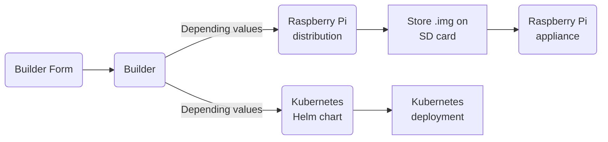
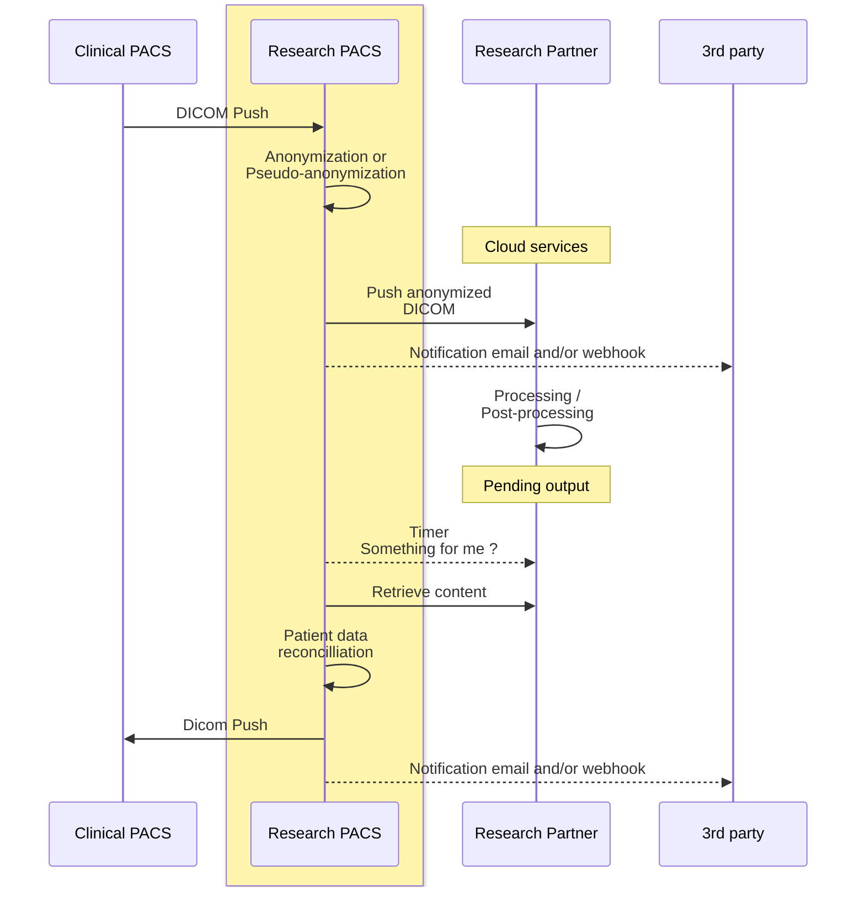

# Research Pacs Server

## What is research-pacs

A PACS (Picture Archiving and Communication System) is a system for managing medical images through archiving functions. It allows communication via network network (DICOM format) and therefore remote or local treatment.

The DICOM format, Digital Imaging and Communications in Medicine, is a standard for IT management of data from medical imaging.

This project provides a full solution for Medical Science Research members, to build appliance (Raspberry Pi based) or to install on Kubernetes (though Helm chart installer), a complete PACS server, enabling local anonymisation, local export, cloud export, and feedback reintegration.

**French:** *Le projet permet de générer au choix, des appliances (pour Raspberry Pi) ou des déploiements Kubernetes (en tant que Helm chart), fournissant les services de PACS de recherche, permettant anonymisation interne, export insitu, export cloud, et la réintégration de feedback externe.*

## Check the builder form

## Supported cases

## Regulations
The builder form ensures/imposes/stores regulatory data (RGPD checks and Data Protection Records for [CNIL MR-001](https://www.cnil.fr/sites/cnil/files/atoms/files/mr-001.pdf)), also embed responsible team members list and contacts list.

## Contacts
Feel free to contact us about your projects : info@wareld.com

## Similar projects and inspiration links
- https://pubmed.ncbi.nlm.nih.gov/10942990/
- https://doi.org/10.1016/0020-7101(92)90032-N
- https://www.medicalconnections.co.uk/kb/Basic-DICOM-Operations
- https://github.com/pydicom/pynetdicom
- https://github.com/aphp/SPHERE
- https://docteurimago.fr/management/gestion/le-pacs-recherche-element-cle-de-la-recherche-medicale-dans-les-hopitaux/
